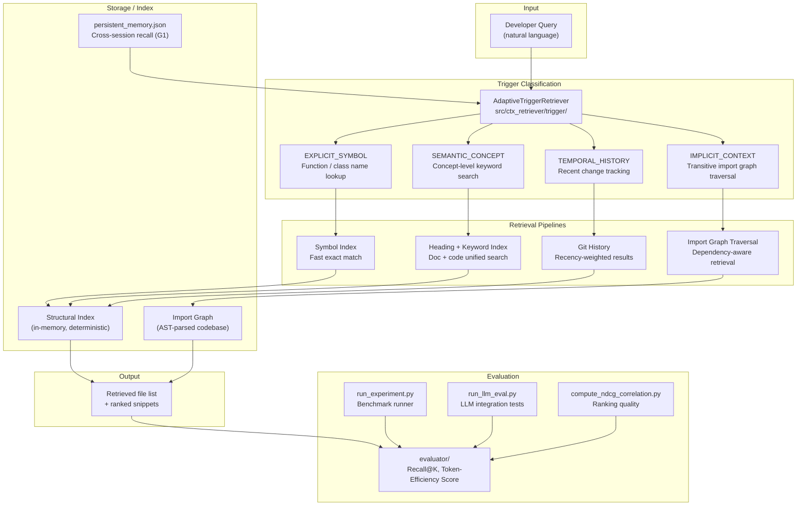

# CTX Architecture

## Overview

CTX (Contextual Trigger eXtraction) is a deterministic, non-LLM code and document retrieval
system for code-aware LLM agents. It classifies developer queries into four trigger types and
routes each to a specialized retrieval pipeline. No LLM calls are made during retrieval —
all logic is heuristic and structural-index based, achieving sub-millisecond response time.

**Key result**: 1.9x higher Token-Efficiency Score vs BM25 using only 5.2% of tokens.
Recall@5 = 1.0 on implicit dependency queries (BM25: 0.4).

## Concept Diagram



## Component Descriptions

| Component | Location | Role |
|-----------|----------|------|
| `AdaptiveTriggerRetriever` | `src/ctx_retriever/retrieval/adaptive_trigger.py` | Top-level API; classifies query and routes to pipeline |
| `trigger/` | `src/ctx_retriever/trigger/` | Trigger type classification |
| `retrieval/` | `src/ctx_retriever/retrieval/` | Per-trigger retrieval strategies |
| `analysis/` | `src/ctx_retriever/analysis/` | Import graph analysis and codebase indexing |
| `evaluator/` | `src/ctx_retriever/evaluator/` | Recall@K, Token-Efficiency, NDCG metrics |
| `visualizer/` | `src/ctx_retriever/visualizer/` | Result visualization |
| `persistent_memory.json` | runtime | Cross-session associative memory (G1 feature) |
| `run_experiment.py` | root | Full benchmark pipeline runner |
| `run_llm_eval.py` | root | LLM-integration evaluation (OpenRouter/local) |
| `benchmarks/` | root | COIR / BEIR benchmark datasets and results |
| `hf_space/` | root | HuggingFace Spaces demo deployment |

## Trigger Type Reference

| Trigger | Example Query | Strategy |
|---------|--------------|----------|
| `EXPLICIT_SYMBOL` | "where is `AuthMiddleware` defined?" | Symbol index exact match |
| `SEMANTIC_CONCEPT` | "how does authentication work?" | Heading + keyword unified search |
| `TEMPORAL_HISTORY` | "what changed recently in the auth module?" | Git history + recency weighting |
| `IMPLICIT_CONTEXT` | "what breaks if I change `db.connect()`?" | AST import graph traversal |

## Key Benchmark Results

- R@3 overall: CTX 0.713 vs BM25 0.540 (+17.3pp, p=3.0e-6)
- R@5 heading_paraphrase: CTX 1.000 vs BM25 0.828 (+17.2pp, p=0.013)
- Token-Efficiency Score: 1.9x vs BM25, using 5.2% of tokens
- Code search R@5: 0.958 (CTX) vs 0.946 (BM25) — statistically equivalent
- IMPLICIT_CONTEXT Recall@5: 1.0 (CTX) vs 0.4 (BM25)

## Data Flow

```
Developer query
  └─ AdaptiveTriggerRetriever.retrieve(query_text, k=5)
       └─ trigger classifier → trigger type
            └─ strategy router
                 ├─ Symbol Index       (EXPLICIT_SYMBOL)
                 ├─ Keyword Index      (SEMANTIC_CONCEPT)
                 ├─ Git History        (TEMPORAL_HISTORY)
                 └─ Import Graph       (IMPLICIT_CONTEXT)
                          │
                     Ranked file list (top-K)
                          │
                 LLM agent uses as context
```

## Related
- [[projects/CTX/research/20260407-g1-final-eval-benchmark|20260407-g1-final-eval-benchmark]]
- [[projects/CTX/research/20260424-memory-retrieval-benchmark-landscape|20260424-memory-retrieval-benchmark-landscape]]
- [[projects/CTX/decisions/20260326-unified-doc-code-indexing|20260326-unified-doc-code-indexing]]
- [[projects/CTX/research/20260426-ctx-retrieval-benchmark-synthesis|20260426-ctx-retrieval-benchmark-synthesis]]
- [[projects/CTX/research/20260402-production-context-retrieval-research|20260402-production-context-retrieval-research]]
- [[projects/CTX/research/20260409-bm25-memory-generalization-research|20260409-bm25-memory-generalization-research]]
- [[projects/CTX/research/20260407-g1-temporal-eval-results|20260407-g1-temporal-eval-results]]
- [[projects/CTX/research/20260407-g1-spiral-eval-results|20260407-g1-spiral-eval-results]]
